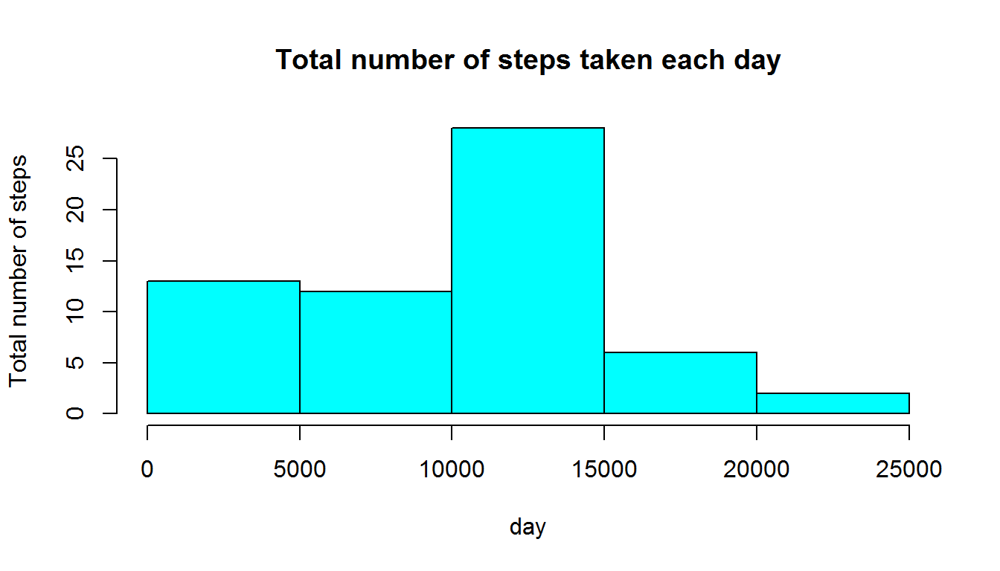
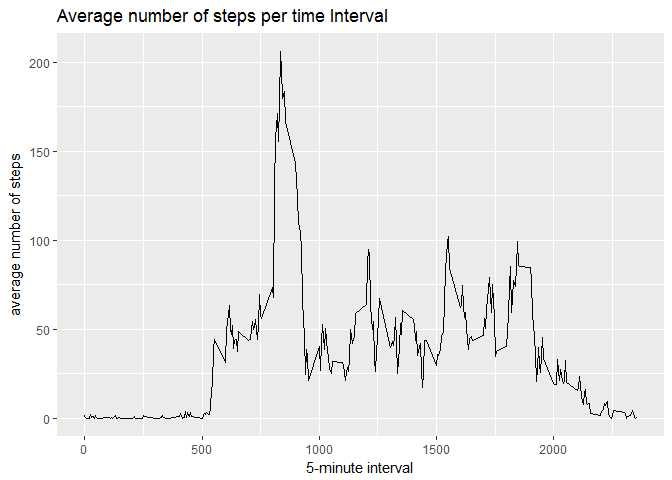

# Reproducible Research - Course Project 1 - Activity Monitoring Data
Santiago Ramirez  
16 November 2017  

## Dataset Description
The variables included in the dataset are:

* **steps**: Number of steps taking in a 5-minute interval (missing values are coded as NA)
* **date**: The date on which the measurement was taken in YYYY-MM-DD format
* **interval**: Identifier for the 5-minute interval in which measurement was taken

The dataset is stored in a comma-separated-value (CSV) file and there are a total of 17,568 observations in this dataset.


## Loading and preprocessing the data

**1. - Load the data**


```r
activity <- read.csv("activity.csv", sep = ",")
head(activity)
```

```
##   steps       date interval
## 1    NA 2012-10-01        0
## 2    NA 2012-10-01        5
## 3    NA 2012-10-01       10
## 4    NA 2012-10-01       15
## 5    NA 2012-10-01       20
## 6    NA 2012-10-01       25
```

```r
#To know about the data
str(activity)
```

```
## 'data.frame':	17568 obs. of  3 variables:
##  $ steps   : int  NA NA NA NA NA NA NA NA NA NA ...
##  $ date    : Factor w/ 61 levels "2012-10-01","2012-10-02",..: 1 1 1 1 1 1 1 1 1 1 ...
##  $ interval: int  0 5 10 15 20 25 30 35 40 45 ...
```

```r
summary(activity)
```

```
##      steps                date          interval     
##  Min.   :  0.00   2012-10-01:  288   Min.   :   0.0  
##  1st Qu.:  0.00   2012-10-02:  288   1st Qu.: 588.8  
##  Median :  0.00   2012-10-03:  288   Median :1177.5  
##  Mean   : 37.38   2012-10-04:  288   Mean   :1177.5  
##  3rd Qu.: 12.00   2012-10-05:  288   3rd Qu.:1766.2  
##  Max.   :806.00   2012-10-06:  288   Max.   :2355.0  
##  NA's   :2304     (Other)   :15840
```


**2. - Process/transform the data (if necessary) into a format suitable for your analysis**


```r
activity$date <- as.Date(activity$date, "%Y-%m-%d")
#validate if type of data for "Date" has changed
str(activity)
```

```
## 'data.frame':	17568 obs. of  3 variables:
##  $ steps   : int  NA NA NA NA NA NA NA NA NA NA ...
##  $ date    : Date, format: "2012-10-01" "2012-10-01" ...
##  $ interval: int  0 5 10 15 20 25 30 35 40 45 ...
```
Now, date is of type "Date"

## What is mean total number of steps taken per day?


**1. - Calculate the total number of steps taken per day**


```r
total.steps <- tapply(activity$steps, activity$date, FUN = sum, na.rm = TRUE)
head(total.steps)
```

```
## 2012-10-01 2012-10-02 2012-10-03 2012-10-04 2012-10-05 2012-10-06 
##          0        126      11352      12116      13294      15420
```


**2. - Make a histogram of the total number of steps taken each day**


```r
hist(total.steps, xlab = "day", ylab = "Total number of steps", main = "Total number of steps taken each day", col = "cyan")
```

<!-- -->


**3. - Calculate and report the mean and median of the total number of steps taken per day**


```r
#First calculate the mean
mean.steps <- tapply(activity$steps, activity$date, FUN = mean, na.rm = TRUE)
#Second calcuate the median
median.steps <- tapply(activity$steps, activity$date, FUN = median, na.rm = TRUE)

print(mean.steps)
```

```
## 2012-10-01 2012-10-02 2012-10-03 2012-10-04 2012-10-05 2012-10-06 
##        NaN  0.4375000 39.4166667 42.0694444 46.1597222 53.5416667 
## 2012-10-07 2012-10-08 2012-10-09 2012-10-10 2012-10-11 2012-10-12 
## 38.2465278        NaN 44.4826389 34.3750000 35.7777778 60.3541667 
## 2012-10-13 2012-10-14 2012-10-15 2012-10-16 2012-10-17 2012-10-18 
## 43.1458333 52.4236111 35.2048611 52.3750000 46.7083333 34.9166667 
## 2012-10-19 2012-10-20 2012-10-21 2012-10-22 2012-10-23 2012-10-24 
## 41.0729167 36.0937500 30.6284722 46.7361111 30.9652778 29.0104167 
## 2012-10-25 2012-10-26 2012-10-27 2012-10-28 2012-10-29 2012-10-30 
##  8.6527778 23.5347222 35.1354167 39.7847222 17.4236111 34.0937500 
## 2012-10-31 2012-11-01 2012-11-02 2012-11-03 2012-11-04 2012-11-05 
## 53.5208333        NaN 36.8055556 36.7048611        NaN 36.2465278 
## 2012-11-06 2012-11-07 2012-11-08 2012-11-09 2012-11-10 2012-11-11 
## 28.9375000 44.7326389 11.1770833        NaN        NaN 43.7777778 
## 2012-11-12 2012-11-13 2012-11-14 2012-11-15 2012-11-16 2012-11-17 
## 37.3784722 25.4722222        NaN  0.1423611 18.8923611 49.7881944 
## 2012-11-18 2012-11-19 2012-11-20 2012-11-21 2012-11-22 2012-11-23 
## 52.4652778 30.6979167 15.5277778 44.3993056 70.9270833 73.5902778 
## 2012-11-24 2012-11-25 2012-11-26 2012-11-27 2012-11-28 2012-11-29 
## 50.2708333 41.0902778 38.7569444 47.3819444 35.3576389 24.4687500 
## 2012-11-30 
##        NaN
```

```r
print(median.steps)
```

```
## 2012-10-01 2012-10-02 2012-10-03 2012-10-04 2012-10-05 2012-10-06 
##         NA          0          0          0          0          0 
## 2012-10-07 2012-10-08 2012-10-09 2012-10-10 2012-10-11 2012-10-12 
##          0         NA          0          0          0          0 
## 2012-10-13 2012-10-14 2012-10-15 2012-10-16 2012-10-17 2012-10-18 
##          0          0          0          0          0          0 
## 2012-10-19 2012-10-20 2012-10-21 2012-10-22 2012-10-23 2012-10-24 
##          0          0          0          0          0          0 
## 2012-10-25 2012-10-26 2012-10-27 2012-10-28 2012-10-29 2012-10-30 
##          0          0          0          0          0          0 
## 2012-10-31 2012-11-01 2012-11-02 2012-11-03 2012-11-04 2012-11-05 
##          0         NA          0          0         NA          0 
## 2012-11-06 2012-11-07 2012-11-08 2012-11-09 2012-11-10 2012-11-11 
##          0          0          0         NA         NA          0 
## 2012-11-12 2012-11-13 2012-11-14 2012-11-15 2012-11-16 2012-11-17 
##          0          0         NA          0          0          0 
## 2012-11-18 2012-11-19 2012-11-20 2012-11-21 2012-11-22 2012-11-23 
##          0          0          0          0          0          0 
## 2012-11-24 2012-11-25 2012-11-26 2012-11-27 2012-11-28 2012-11-29 
##          0          0          0          0          0          0 
## 2012-11-30 
##         NA
```

## What is the average daily activity pattern?


**1. - Make a time series plot (i.e. type = "l") of the 5-minute interval (x-axis) and the average number of steps taken, averaged across all days (y-axis)**


```r
averages.steps <- aggregate(x = list(steps = activity$steps), by = list(interval = activity$interval), 
    FUN = mean, na.rm = TRUE)
ggplot(data = averages.steps, aes(x = interval, y = steps)) + geom_line() + xlab("5-minute interval") + 
    ylab("average number of steps") + ggtitle("Average number of steps per time Interval")
```

<!-- -->


**2. - Which 5-minute interval, on average across all the days in the dataset, contains the maximum number of steps?**


```r
averages.steps[which.max(averages.steps$steps),]
```

```
##     interval    steps
## 104      835 206.1698
```

The 5-minute interval with the (average) maximum number of steps is the interval **835** with **206** steps on average.


## Imputing missing values

Note that there are a number of days/intervals where there are missing values (coded as NA).
The presence of missing days may introduce bias into some calculations or summaries of the data.

**1. - Calculate and report the total number of missing values in the dataset (i.e. the total number of rows with NAs)**


```r
#Since it might be possible that one observation could have more that 1 NA, the count will be done by obsrevations,
#regardless the amount of NA present on each observation, the fact of finding 1, 2 or 3 NA, it will be considered as 1

dimension <- dim(activity)[1]
counter <- 1
nacounter <- 0
nasum <- 0

while (counter <= dimension) {
        nasum <- sum(is.na(activity[counter,]))
        if (nasum > 0) {
                nacounter <- nacounter + 1
                nasum <- 0
        }
        counter <- counter + 1
}

print(nacounter)
```

```
## [1] 2304
```

```r
# To compare, calculate the total amount of NA in the data set

sum(is.na(activity))
```

```
## [1] 2304
```

The total amount of missing values in the observations is **2304**.
Important to highlight that is the same value of NA present, which indicate that each observation
has not more than 1 NA value.


**2. - Devise a strategy for filling in all of the missing values in the dataset. The  strategy does not need to be sophisticated. For example, you could use the mean/median for that day, or the mean for that 5-minute interval, etc.**


**Strategy Definition:**

* Create a new table with all dates and the average value of steps per day
* For those dates that have no value, the general average "steps" value will be used
* The table with be used to fill the NA fields in the data frame "activity".
* The values from this table "averge.stepsDay" will be used only in NA data

First, create a table with the average steps per day


```r
averages.stepsDay <- aggregate(x = list(stepsAvg = activity$steps), by = list(date = activity$date), FUN = mean, na.rm = TRUE)

head(averages.stepsDay, 20)
```

```
##          date stepsAvg
## 1  2012-10-01      NaN
## 2  2012-10-02  0.43750
## 3  2012-10-03 39.41667
## 4  2012-10-04 42.06944
## 5  2012-10-05 46.15972
## 6  2012-10-06 53.54167
## 7  2012-10-07 38.24653
## 8  2012-10-08      NaN
## 9  2012-10-09 44.48264
## 10 2012-10-10 34.37500
## 11 2012-10-11 35.77778
## 12 2012-10-12 60.35417
## 13 2012-10-13 43.14583
## 14 2012-10-14 52.42361
## 15 2012-10-15 35.20486
## 16 2012-10-16 52.37500
## 17 2012-10-17 46.70833
## 18 2012-10-18 34.91667
## 19 2012-10-19 41.07292
## 20 2012-10-20 36.09375
```

Some days have no steps information. This fields will be updated with the general steps average


```r
avgsteps <- mean(activity$steps, na.rm = TRUE)
```

Fill the gaps with avgsteps


```r
dimension <- dim(averages.stepsDay)[1]
index <- 1
while (index <= dimension) {
        if (is.na(averages.stepsDay[index, 2])) {
                averages.stepsDay[index, 2] <- avgsteps
        }
        index <- index + 1
}

head(averages.stepsDay, 20)
```

```
##          date stepsAvg
## 1  2012-10-01 37.38260
## 2  2012-10-02  0.43750
## 3  2012-10-03 39.41667
## 4  2012-10-04 42.06944
## 5  2012-10-05 46.15972
## 6  2012-10-06 53.54167
## 7  2012-10-07 38.24653
## 8  2012-10-08 37.38260
## 9  2012-10-09 44.48264
## 10 2012-10-10 34.37500
## 11 2012-10-11 35.77778
## 12 2012-10-12 60.35417
## 13 2012-10-13 43.14583
## 14 2012-10-14 52.42361
## 15 2012-10-15 35.20486
## 16 2012-10-16 52.37500
## 17 2012-10-17 46.70833
## 18 2012-10-18 34.91667
## 19 2012-10-19 41.07292
## 20 2012-10-20 36.09375
```

There is now a value for each day.

Next step is to add the corresponding step value in the orignal table, according to the date


```r
activity2 <- merge(x = activity, y = averages.stepsDay, by = "date")

#If data in "steps" is NA, it will be replaced by the value in "stepAvg"
dimension <- dim(activity2)[1]
index <- 1
while (index <= dimension) {
        if (is.na(activity2[index, 2])) {
                activity2[index, 2] <- activity2[index, 4]
        }
        index <- index + 1
}
```

**3. - Create a new dataset that is equal to the original dataset but with the missing data filled in.**


```r
activity3 <- subset(activity2, select = c("steps", "date", "interval"))
head(activity3, 10) #This data Frame has the same estructure of the original data but without NA values
```

```
##      steps       date interval
## 1  37.3826 2012-10-01        0
## 2  37.3826 2012-10-01        5
## 3  37.3826 2012-10-01       10
## 4  37.3826 2012-10-01       15
## 5  37.3826 2012-10-01       20
## 6  37.3826 2012-10-01       25
## 7  37.3826 2012-10-01       30
## 8  37.3826 2012-10-01       35
## 9  37.3826 2012-10-01       40
## 10 37.3826 2012-10-01       45
```


 


